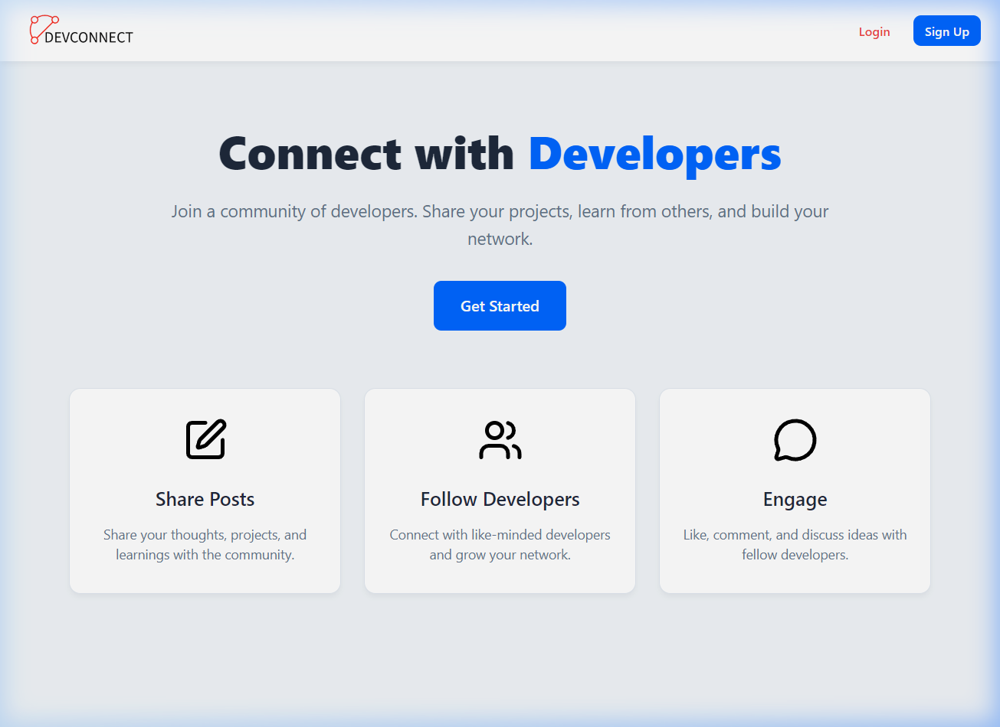
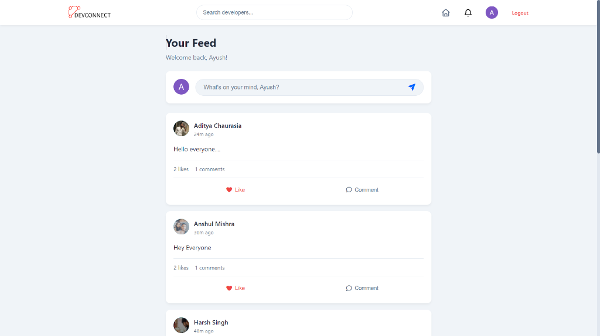
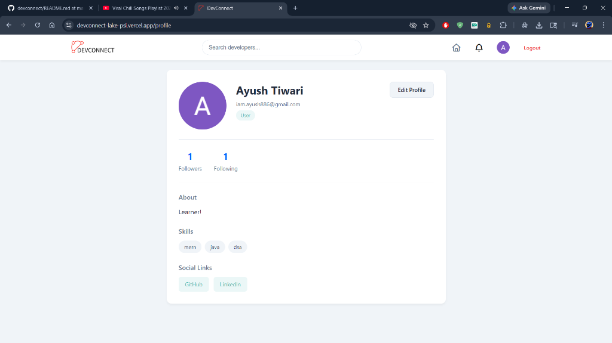
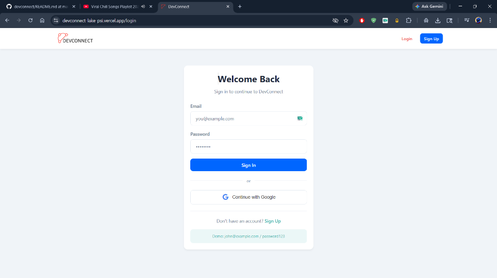
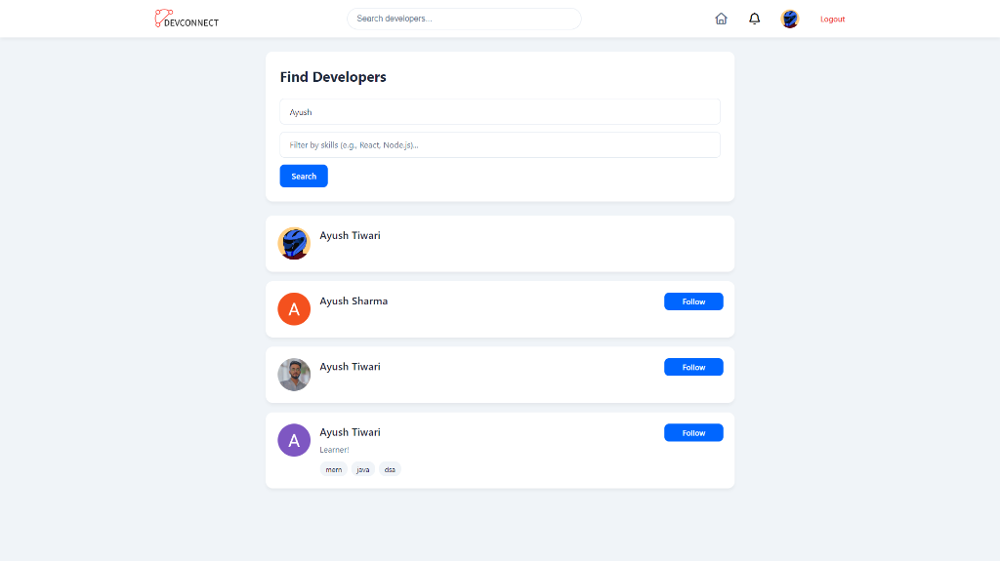

# 🚀 DevConnect

[](https://opensource.org/licenses/MIT)
[](https://nodejs.org/)
[](https://reactjs.org/)
[](https://vitejs.dev/)

**DevConnect** is a premium social platform built for developers to connect, share projects, and collaborate in real-time. Built with the **MERN stack**, it offers a sleek, minimalist interface and powerful features for professional networking.

---

## 📸 Screenshots

<p align="center">
  
  <br>
  <em>Landing Page - Your Gateway to the Developer Community</em>
</p>

### Key Features at a Glance
| **Developer Feed** | **User Profile** |
| :---: | :---: |
|  |  |
| **Authentication** | **Search & Discovery** |
|  |  |

---

## ✨ Features

- 🔐 **Secure Authentication**: JWT-based email/password login and **Google OAuth** integration.
- 📱 **Responsive Design**: Fully optimized for mobile, tablet, and desktop using **Tailwind CSS**.
- 💬 **Developer Feed**: Post updates, share code snippets, and engage with the community.
- 👤 **Rich Profiles**: Showcase your skills, experience, and projects.
- 🔍 **Advanced Search**: Find other developers by name or specific skill sets.
- 🔔 **Real-time Notifications**: Stay updated with likes, comments, and new followers.
- ☁️ **Cloud Storage**: Image uploads for profiles and posts (powered by Multer).

---

## 🛠️ Tech Stack

### Frontend
- **Framework**: [React 19](https://reactjs.org/)
- **State Management**: [Redux Toolkit](https://redux-toolkit.js.org/)
- **Icons**: [Lucide React](https://lucide.dev/)
- **Styling**: [Tailwind CSS](https://tailwindcss.com/)
- **Build Tool**: [Vite](https://vitejs.dev/)

### Backend
- **Runtime**: [Node.js](https://nodejs.org/)
- **Framework**: [Express.js](https://expressjs.com/)
- **Database**: [MongoDB](https://www.mongodb.com/) with [Mongoose](https://mongoosejs.com/)
- **Authentication**: [Passport.js](https://www.passportjs.org/) & [JWT](https://jwt.io/)
- **Validation**: [Joi](https://joi.dev/)

---

## 🚀 Getting Started

### Prerequisites
- [Node.js](https://nodejs.org/en/download/) (v18 or higher)
- [MongoDB](https://www.mongodb.com/try/download/community) (local or Atlas)

### Installation

1. **Clone the repository**
   ```bash
   git clone https://github.com/Ayushtiw5/devconnect.git
   cd devconnect
   ```

2. **Backend Setup**
   ```bash
   cd server
   npm install
   cp .env.example .env
   # Update .env with your MongoDB URI and Secret Keys
   npm run dev
   ```

3. **Frontend Setup**
   ```bash
   cd ../client
   npm install
   npm run dev
   ```

4. **Open in Browser**
   Navigate to `http://localhost:5173`

---

## 📂 Project Structure

```text
devconnect/
├── client/             # React frontend
│   ├── src/
│   │   ├── components/ # Reusable UI components
│   │   ├── pages/      # View pages
│   │   ├── store/      # Redux state management
│   │   └── utils/      # Client-side helpers
├── server/             # Express backend
│   ├── src/
│   │   ├── controllers/# Route logic
│   │   ├── models/     # Mongoose schemas
│   │   ├── routes/     # API endpoints
│   │   └── config/     # System configuration
└── screenshots/        # Project visuals
```

---

## 👨‍💻 Contributing

Contributions are welcome! Please feel free to submit a Pull Request.

1. Fork the Project
2. Create your Feature Branch (`git checkout -b feature/AmazingFeature`)
3. Commit your Changes (`git commit -m 'Add some AmazingFeature'`)
4. Push to the Branch (`git push origin feature/AmazingFeature`)
5. Open a Pull Request

---

## 📄 License

Distributed under the MIT License. See `LICENSE` for more information.

---

<p align="center">Made with ❤️ for Developers</p>
