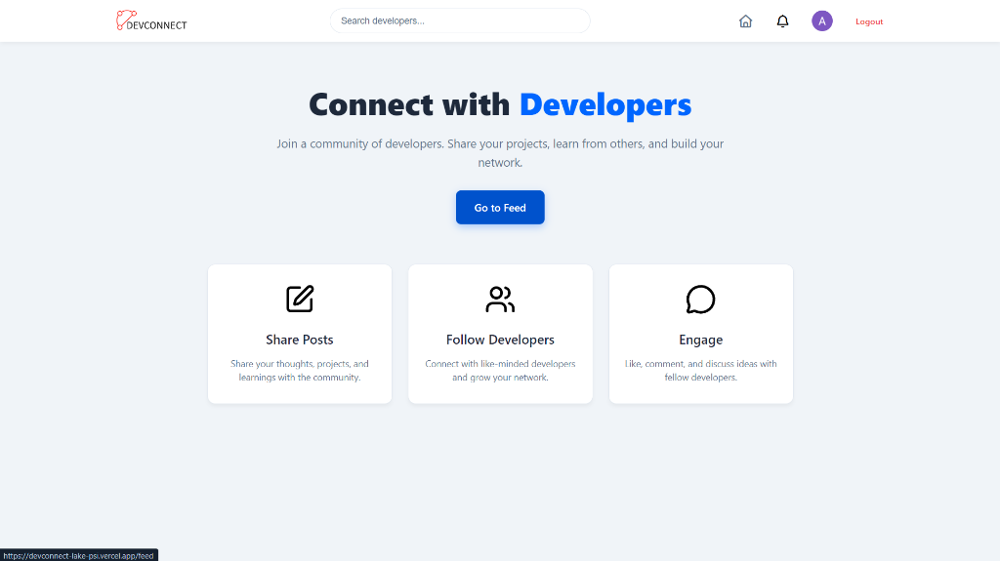
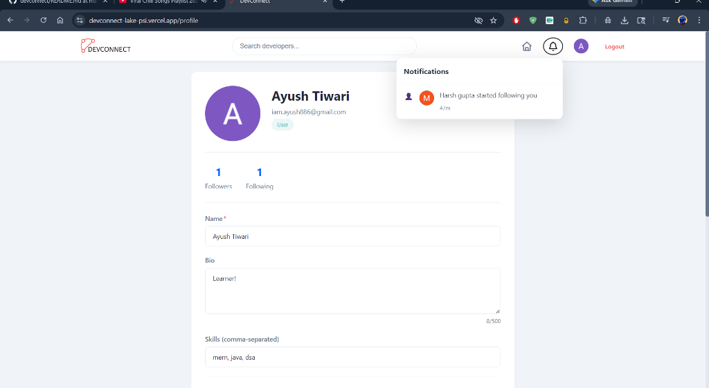

# 🚀 DevConnect - The Ultimate Developer Network

[](https://devconnect-lake-psi.vercel.app/)
[](https://opensource.org/licenses/MIT)
[](https://nodejs.org/)
[](https://react.dev/)

**DevConnect** is a premium social platform designed exclusively for developers to connect, share their journeys, and collaborate on world-changing projects. Built with a modern **MERN stack**, it offers a seamless, real-time experience for the global developer community.

---

## 📸 Visual Tour

<p align="center">
  
  <br>
  <em>Personalized Landing Page - Highlighting Community Engagement</em>
</p>

### 💻 Developer Experience
| **Interactive Feed** | **Professional Profile** |
| :---: | :---: |
|  |  |
| **Real-time Notifications** | **Developer Discovery** |
|  |  |
| **Modern Auth** | **Project Showcase** |
|  |  |

---

## 🏗️ System Architecture

DevConnect follows a robust **decoupled architecture**, ensuring scalability and high performance.

### 🎨 Frontend (The Experience)
- **Framework**: [React 19](https://react.dev/) for a declarative, component-based UI.
- **State Management**: [Redux Toolkit](https://redux-toolkit.js.org/) for predictable state containerization.
- **Styling**: [Tailwind CSS](https://tailwindcss.com/) for a utility-first, modern aesthetic.
- **Icons**: [Lucide React](https://lucide.dev/) for sleek, pixel-perfect iconography.
- **Client Deployment**: Hosted on [Vercel](https://vercel.com/) for lightning-fast delivery.

### ⚙️ Backend (The Engine)
- **Runtime**: [Node.js](https://nodejs.org/) & [Express.js](https://expressjs.com/) for a performant event-driven API.
- **Database**: [MongoDB](https://www.mongodb.com/) with [Mongoose ODM](https://mongoosejs.com/) for flexible, document-based storage.
- **Authentication**: Dual-layer security with [JWT](https://jwt.io/) and [Passport.js](https://www.passportjs.org/) (including **Google OAuth 2.0**).
- **Security**: Reinforced with [Helmet](https://helmetjs.github.io/), rate limiting, and input sanitization.
- **Server Deployment**: Hosted on [Render](https://render.com/) with automated CI/CD.

---

## 💡 How it Works

1.  **Onboarding**: Users start by creating a professional account via email or their Google profile.
2.  **Profile Building**: Developers showcase their expertise by adding skills (MERN, Python, DSA, etc.) and social links.
3.  **Discovery**: An advanced search engine allows users to find other developers based on their name or specific tech stack.
4.  **Interaction**: 
    -   **Posts**: Share project updates or technical thoughts in the community feed.
    -   **Engagement**: Like and comment on peer posts to build relationships.
    -   **Follow System**: Follow developers to receive their latest updates directly in your feed.
5.  **Real-time Feedback**: Instant notifications keep users engaged when their content is interacted with or when they gain new followers.

---

## ✨ Core Features

- 🔑 **Secure Authentication**: Encrypted password storage (Bcrypt) and Google Single Sign-On.
- 📬 **Live Feed**: A dynamic, scrollable feed of the latest developer community activities.
- 🛠️ **Skill-Based Discovery**: Advanced filtering to find developers with matching interests or expertise.
- 🖼️ **Image Support**: Integrated image handling for customizable profiles and posts.
- 📱 **Fully Responsive**: A "mobile-first" philosophy ensuring a great experience on any device.
- 🚀 **Production Ready**: Optimized for speed, security, and developer-friendly maintenance.

---

## 🚀 Local Development

### Installation

1.  **Clone the Repository**
    ```bash
    git clone https://github.com/Ayushtiw5/devconnect.git
    cd devconnect
    ```

2.  **Server Setup**
    ```bash
    cd server
    npm install
    # Configure your .env file (see .env.example)
    npm run dev
    ```

3.  **Client Setup**
    ```bash
    cd ../client
    npm install
    npm run dev
    ```

---

## 👨‍💻 Author

**Ayush Tiwari** - *Full Stack Developer*
- [GitHub](https://github.com/Ayushtiw5)
- [LinkedIn](https://linkedin.com/in/iamayush886)
- [Live Site](https://devconnect-lake-psi.vercel.app/)

---

<p align="center">Made with ❤️ for the Global Developer Community</p>
